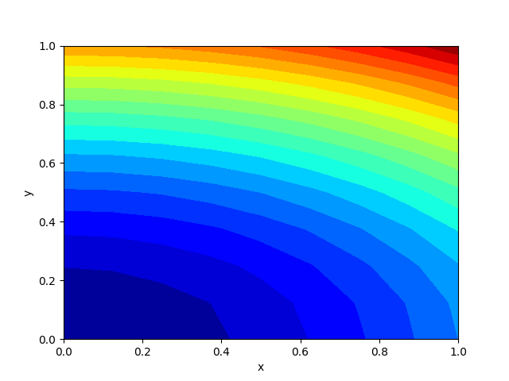

## Empirical Comparison of PDE Solvers: FEM vs DL

### Usage

To scripts require [FEniCS distribution](https://fenicsproject.org/download/)
installed 
as well as [Tensorflow 2](https://www.tensorflow.org/install) 
backend for the DeepXDE solver.

- Install the requirements with `pip`:

```
$ pip install -r requirements.txt
```

- Run the FEM solver for the 2D heat equation:

```
$ python fem_solver_heat2d.py
```

- Run the DL solver for the 2D heat equation:

```
$ python dl_solver_heat2d.py
```

- Run the FEM solver for the Nonlinear Poisson equation:

```
$ python fem_solver_poisson.py
```

- Run the DL solver for the Nonlinear Poisson equation:

```
$ python dl_solver_poisson.py
```

- Run the comparison script:

```
$ python run_comparison.py
```


### Results

#### 2D Heat Equation

FEniCS         |  DeepXDE     |
:-------------------------:|:-------------------------:|
  |   |


#### Non-linear Poisson equation

FEniCS         |  DeepXDE     |
:-------------------------:|:-------------------------:|
  |   |


### More examples

Wide galleries of examples are available at:
- [FEniCS examples](https://github.com/hplgit/fenics-tutorial/tree/master/src/vol1/python)
- [DeepXDE examples](https://github.com/lululxvi/deepxde/blob/master/examples/)


### References

1. Langtangen, Mardal - Introduction to Numerical 
   Methods for Variational Problems (2016). 
   Web: https://hplgit.github.io/fem-book/doc/web/index.html
2. Langtangen, Logg - Solving PDEs in Python, 
   The FEniCS Tutorial I (2016). 
   Web: https://www.springer.com/gp/book/9783319524610
3. Lu et al - DeepXDE: A deep learning library for 
   solving differential equations (2019). 
   Web: https://arxiv.org/abs/1907.04502

   
